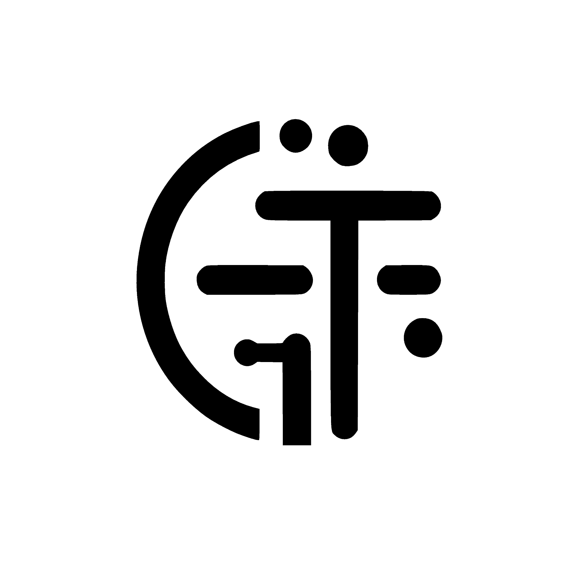
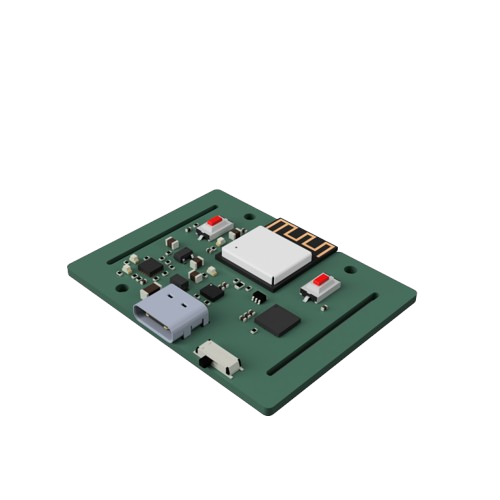
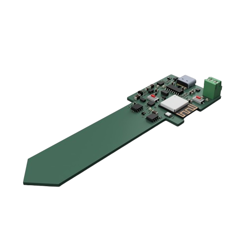

<h1 align="left">
  
</h1>

# Jason Too

Hardware, software, and ML products built from the ground up.

I'm an Information and Computer Engineer based in Cambridge, UK. I build across PCB design, firmware, desktop apps, developer tools, and edge AI systems, with a focus on practical products that are understandable enough for other people to inspect, use, and extend.

- Founder of [elektroThing](https://elektrothing.uk)
- MEng from the University of Cambridge
- Building open-source hardware, local-first AI tools, and product software

## Featured Work

  
  
  

**Spark Analyzer**  
Open-source USB-C PD analyzer and programmable power supply built on ESP32-C3.

**Tracer**  
Ultra-low-power IMU tracker for wearable sensing and TinyML experiments.

**Plant-Bot**  
Solar-powered plant monitoring with capacitive soil sensing and automated watering.

## What I Work On

| Area | Focus |
|:--|:--|
| Embedded systems & IoT | PCB design, firmware, low-power devices, ESP32, RP2040, STM32 |
| AI & computer vision | Edge AI, TinyML, OpenCV, PyTorch, TensorFlow Lite |
| Product development | Developer tools, desktop apps, crowdfunding, documentation, shipping |

## Skills & Tools

- **Embedded:** STM32, ESP32, FreeRTOS, LoRaWAN, BLE
- **Hardware:** KiCad, Altium, Fusion 360, 3D printing
- **Software:** Next.js, Electron, Tauri, Docker, CI/CD
- **Data:** Pandas, NumPy, SciPy, scikit-learn

---

