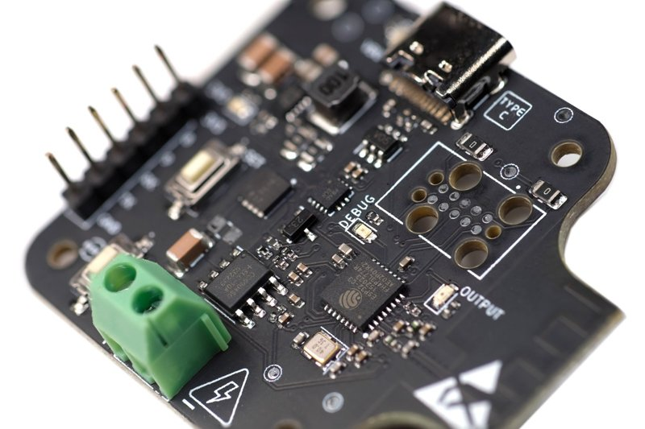
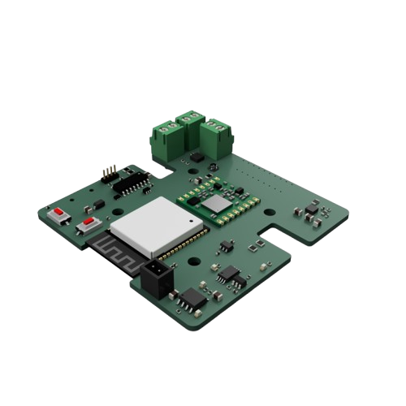
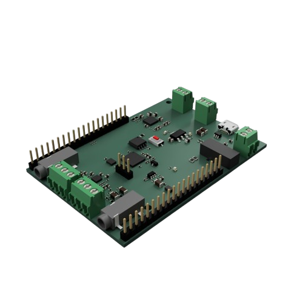
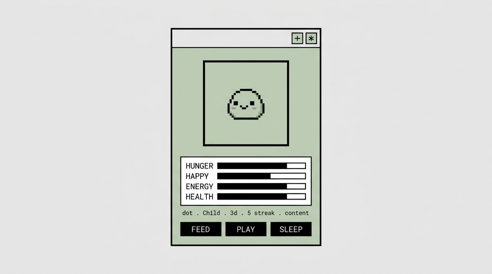
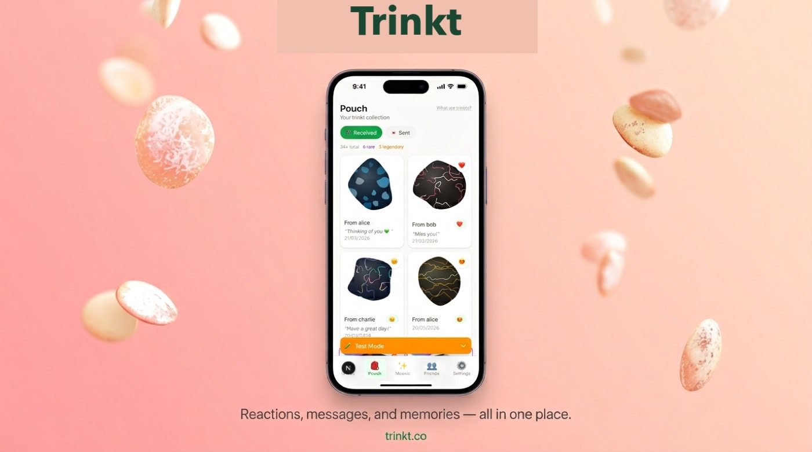

  <a href="https://elektrothing.uk"><picture>
    <source media="(prefers-color-scheme: dark)" srcset="assets/elektrothing-logo-dark.png" />
    
  </picture></a>

# Jason Too

I build hardware, software, and ML products from the ground up.

I'm an Information and Computer Engineer based in Cambridge, UK. My work moves between PCB design, firmware, desktop apps, developer tools, and edge AI systems. I like projects where the hardware constraints shape the software, and where the software makes the hardware easier to inspect, debug, and use.

- Founder of [elektroThing](https://elektrothing.uk)
- MEng from the University of Cambridge
- Open-source hardware, local-first AI tools, desktop apps, and embedded systems

## Hardware Projects

  
  
  
  
  

| Project | What it is | Links |
|:--|:--|:--|
| **Spark Analyzer** | Open-source USB-C PD analyzer and programmable power supply built on ESP32-C3. It can set custom voltages, monitor current draw over WiFi/BLE, and help debug USB-C power behavior without guessing. | [Site](https://elektrothing.uk/work#spark-analyzer) · [GitHub](https://github.com/tooyipjee/Spark-Analyzer) |
| **Tracer** | Ultra-low-power IMU tracker for wearables and motion sensing. Designed around long battery life, compact hardware, and TinyML-ready firmware. | [Site](https://elektrothing.uk/work#tracer) |
| **Plant-Bot** | Solar-powered plant monitoring and automated watering system with capacitive soil sensing, environmental monitoring, WiFi alerts, and a pump driver. | [Site](https://elektrothing.uk/work#plant-bot) |
| **FLORA** | Solar ESP32 garden weather station with LoRa, soil moisture sensing, temperature/humidity monitoring, and long-range reporting for remote gardens. | [Site](https://elektrothing.uk/work#flora) |
| **DS-Pi** | RP2040 audio DSP board with an audio codec, headphone amp, and prototyping-friendly I/O for effects and signal-processing experiments. | [Site](https://elektrothing.uk/work#ds-pi) · [GitHub](https://github.com/tooyipjee/DS-Pi) |

## Software & AI Projects

  
  
  
  
  

| Project | What it is | Links |
|:--|:--|:--|
| **codekeep** | Terminal roguelike deckbuilder built with Ink/React. It reads local git history and turns development activity into game state. | [Site](https://elektrothing.uk/work#codekeep) · [GitHub](https://github.com/tooyipjee/codekeep) |
| **ollamacode** | Offline AI coding CLI powered by Ollama. It can work with files and commands directly without cloud API keys. | [Site](https://elektrothing.uk/work#ollamacode) · [GitHub](https://github.com/tooyipjee/ollamacode_cli) |
| **afkode** | Frameless terminal overlay with a global hotkey, tabs, shell configuration, and cross-platform desktop packaging. | [Site](https://elektrothing.uk/work#afkode) · [GitHub](https://github.com/tooyipjee/afkode) |
| **dot** | Menu bar desktop pet built with Tauri v2 and Rust, with local persistence, achievements, and a small canvas UI. | [Site](https://elektrothing.uk/work#dot) · [GitHub](https://github.com/tooyipjee/dot) |
| **Trinkt** | Social web app for sending procedurally generated art to friends, built around small private gestures rather than public metrics. | [Site](https://elektrothing.uk/work#trinkt) |

## Skills & Tools

| Area | Stack |
|:--|:--|
| Embedded systems | STM32, ESP32, RP2040, FreeRTOS, LoRaWAN, BLE, power budgets, sensors |
| Hardware design | KiCad, Altium, Fusion 360, 3D printing, small-batch manufacturing |
| Product software | TypeScript, React, Next.js, Electron, Tauri, Rust, CLI tools |
| AI & ML | Python, PyTorch, TensorFlow Lite, TinyML, OpenCV, local model tooling |
| Data | Pandas, NumPy, SciPy, scikit-learn |
| Delivery | Docker, CI/CD, Linux, documentation, crowdfunding |

---

